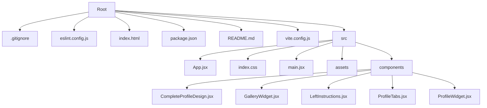

# Lunacal Assignment

## Description

This project is a web application designed to showcase a complete profile design with a gallery feature. It utilizes React for building the user interface and Framer Motion for animations.

## Tech Stack

## Folder Structure

